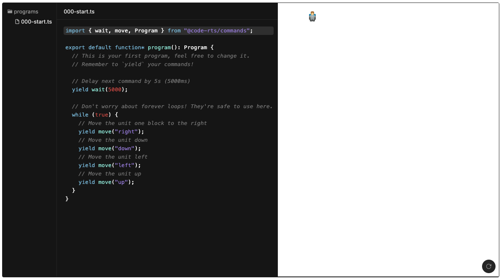

    

<h1 align="center">Code RTS</h1>

⚠️ <b>Work in progress.</b>

    

---

## Motivation

Inspired by the great minds from [Screeps](https://screeps.com/), motivated by the amazing art from [Kenney](https://kenney.nl/), excited by the [CodeSandbox's Sandpack](https://github.com/codesandbox/sandpack), hugely inspired by Jacob from [aarthificial](https://www.youtube.com/c/aarthificial)
YouTube channel with their [Motion Canvas](https://www.youtube.com/watch?v=WTUafAwrunE) concept.

From all the things mentioned above the idea for "Code RTS" (still a WIP name)  has born. A game which let you code your colony using [Generators](https://developer.mozilla.org/en-US/docs/Web/JavaScript/Reference/Global_Objects/Generator).
This project is strictly an experiment, so all feedback is highly appreciated! You can use [Discussions tab](https://github.com/jog1t/code-rts/discussions) to talk about features or ideas.

⚠️ Everything in this repo is a subject to change. Proper documentation and more information will be provided very soon.

# Contributing

## Structure

- `packages/app` - main app to interact with the code
- `pacakges/template` - Sandpack template
- `tools` - useful developer tools

## Running locally

1. Run `yarn` in the root folder
2. Run `yarn start` in the root folder to open the app.
   1. ⚠️ For now, it's important that your app runs on :3000 port.
